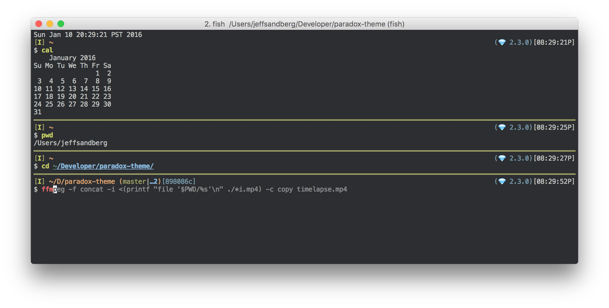

= Paradox's Theme

ifdef::env-github[]
:tip-caption: :bulb:
:note-caption: :information_source:
:important-caption: :heavy_exclamation_mark:
:caution-caption: :fire:
:warning-caption: :warning:
endif::[]

:fish: https://fishshell.com/[fish shell]

This is the latest revision of my terminal theme, for {fish}. It has evolved over the years to its current form.

Many of its features come from {fish} itself, and are lightly customized here

= Features:
Visual Git Status:: Current branch, tracking, current sha

Prompt Timestamp:: Lets you see when the prompt was rendered

Command Separators:: Big thick lines that clearly deliniate when a command started and ended
+
They also show exit statuses, with support for
`pipestatus`

Full Vim Mode Support:: Just add `fish_vi_mode` to your fish configuration, and everything will work as it should

Customizable Colors:: Don't like my color choices? Pick your own. I try to respect fish colors wherever possible, and have a few custom variables for places it needs to be extended
+
See <<colors>> for details.

Automatic iTerm2 colors:: If you're on macOS, iTerm 2 colors are automatically set to the color scheme +
See <<iTerm2 colors>> for details.

Supports https://github.com/tinted-theming/base16-shell/[Base16-shell]:: If you use the https://github.com/tinted-theming/base16-shell/[Base16-shell] project's color schemes, you can use any color scheme they have available. See <<b16ss,Base16-shell support>> for details

Supports light/dark mode:: An interface is exposed to allow the theme to swap between two color schemes, depending on light/dark mode settings. See <<ldm,Light/Dark Mode for details>>

= Installation
== Fisher (easy)
. Install https://github.com/jorgebucaran/fisher[fisher]
. Run `fisher install paradox460/paradox-theme`

== Manual (not hard)
. Clone this repo
. Copy or Symlink the files in `conf.d` to your `~/.config/fish/conf.d` directory
. Copy or symlink the files in `functions` to your `~/.config/fish/functions` directory
. Load a new fish shell up

= Colors
Default fish colors are respected, and can be overridden using any means you like; the web interface, your own configuration, or universal variables.

Color variables support the same syntax as https://fishshell.com/docs/current/cmds/set_color.html[`set_color`]
The following additional variables are used for colorizing parts of the theme:

`paradox_git_prompt_color_hash`::
  This sets the color of the hash display in the git info.
`paradox_status_color_normal`::
  The color of a separator when the previous command had a `0` exit status
`paradox_status_color_error`:: Separator color when previous command had a non-zero exit status

You can also set variables for `__(light|dark)__base00-base0F`, to tune the color schemes used by this shell.

If you customize your colors, you probably want to set the `paradox_disable_scheme_changes` variable, otherwise your custom colors could be clobbered.

[#b16ss]
== Base16-shell support

If you have another https://github.com/tinted-theming/home[Base16] theme you like, you can load the https://github.com/tinted-theming/base16-shell/[shell version] of the color scheme, set the `BASE16_SHELL_ENABLE_VARS` envar, and this theme will now use its colors.

== iTerm2 colors

NOTE: Non-iTerm2 terminals do not need to worry about this configuration

The theme will automatically set iTerm2 colors to match the internally used color palette, so that third party programs (such as those that use curses) will render with your colors.
If you would like to disable this feature, set the variable `paradox_disable_iterm_colors` to `true`

[#ldm]
== Light/Dark Mode
On recent MacOS versions, the theme will automatically switch between Tomorrow and Tomorrow-Night, depending on the current system color mode. This includes automatic color switches with time of day.

The theme will only change colors when the configuration is reloaded, i.e. when launching a new shell. You can set the `paradox_refresh_scheme_on_prompt` variable to true to cause the theme to be set on every prompt.

Alternatively, you can call `paradox_change_color_scheme` at any time to check and set the theme based on current conditions.

If you want to lock your theme to one color mode, or are on a non-macos system, set the variable `paradox_color_scheme` to either `light` or `dark`. The theme should automatically refresh whenever this variable is changed

NOTE: Currently only iTerm2's background color is automatically changed with the scheme. If you use a different terminal, check to see if it supports the ability to detect your system color scheme, or open an issue here.

If you are using a <<b16ss,custom base16 color scheme>>, automatic color changing is disabled. If this is something you'd really like to see, open an issue here.

= Legacy theme
There is an older iteration of this theme, on the https://github.com/paradox460/paradox-theme/tree/v1[v1 branch]. It is no longer maintained, and is only useful for reference purposes.

That version of the theme was a bit slower, used older fish features that are now obsolete, and had a few features that never really worked right (such as command timers).

= All configuration options

`paradox_color_scheme`:: `_light|dark_` Locks the color scheme, regardless of what the system reports. Changing causes color scheme reevaluation.
`paradox_disable_iterm_colors`:: `_boolean_` Disables changing iTerm2 colors
`paradox_disable_scheme_changes`:: `_boolean_` Disables any color source values, only uses the values currently defined in the `base00-base0F` variables.
+
This is useful if you want to use a specific base16 color scheme, but don't want to load the whole shell script for it.
`paradox_refresh_scheme_on_prompt`:: `_boolean_` Triggers a color scheme refresh on _every_ paint of the prompt.

TIP: This theme also has a few custom color variables. See <<Colors>>.

Additionally, the following third-party configuration variables impact this theme:

`BASE16_SHELL_ENABLE_VARS`:: `_boolean_` Triggers importing of a base16-shell color scheme, disabling internal color schemes. See <<b16ss>> for more information

= Useful Functions

`paradox_change_color_scheme`:: Refreshes the color scheme, setting it to the "right" one based on current configurations
