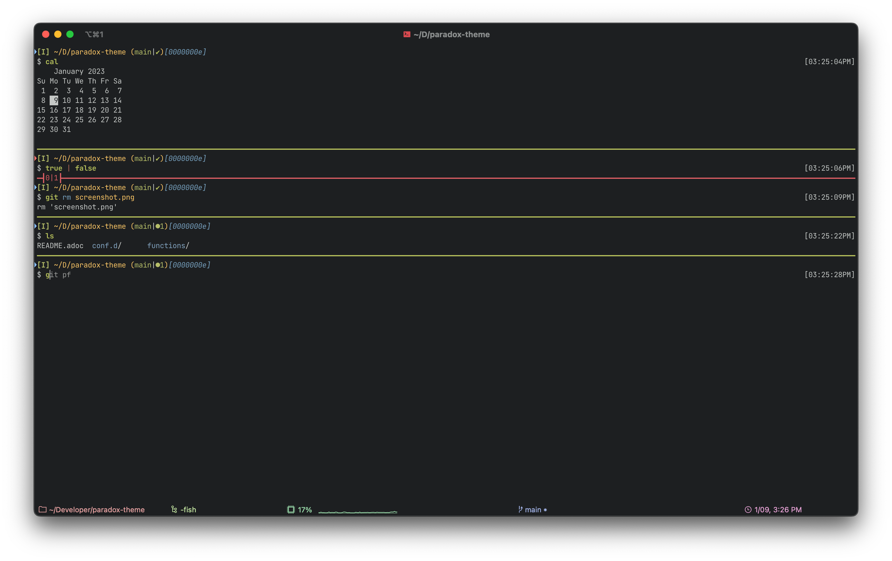

ifdef::env-github[]
:tip-caption: :bulb:
:note-caption: :information_source:
:important-caption: :heavy_exclamation_mark:
:caution-caption: :fire:
:warning-caption: :warning:
endif::[]

:fish: https://fishshell.com/[fish shell]

= Paradox Theme

This is the latest revision of my terminal theme, for {fish}. It has evolved over the years to its current form.

Many of its features come from {fish} itself, and are lightly customized here

== Features:
Visual Git Status:: Current branch, tracking, current sha
Prompt Timestamp:: Lets you see when the prompt was rendered
Command Separators:: Big thick lines that clearly deliniate when a command started and ended
+
They also show exit statuses, with support for
`pipestatus`
Full Vim Mode Support:: Just add `fish_vi_mode` to your fish configuration, and everything will work as it should
Customizable Colors:: Don't like my color choices? Pick your own. I try to respect fish colors wherever possible, and have a few custom variables for places it needs to be extended
+
See <<colors>> for details.
Automatic iTerm2 colors:: If you're on macOS, iTerm 2 colors are automatically set to the color scheme
See <<iTerm2 colors>> for details.

== Installation
=== Fisher (easy)
. Install https://github.com/jorgebucaran/fisher[fisher]
. Run `fisher install paradox460/paradox-theme`

=== Manual (not hard)
. Clone this repo
. Copy or Symlink the files in `conf.d` to your `~/.config/fish/conf.d` directory
. Copy or symlink the files in `functions` to your `~/.config/fish/functions` directory
. Load a new fish shell up

== Colors
Default fish colors are respected, and can be overridden using any means you like; the web interface, your own configuration, or universal variables.

Color variables support the same syntax as https://fishshell.com/docs/current/cmds/set_color.html[`set_color`]
The following additional variables are used for colorizing parts of the theme:

`paradox_git_prompt_color_hash`::
  This sets the color of the hash display in the git info.
`paradox_status_color_normal`::
  The color of a separator when the previous command had a `0` exit status
`paradox_status_color_error`:: Separator color when previous command had a non-zero exit status

TIP: If you have another https://github.com/tinted-theming/home[Base16] theme you like, you can override the varaibles `base00` to `base0f` with your new colors, and everything _should_ just work!

=== iTerm2 colors

NOTE: Non-iTerm2 terminals do not need to worry about this configuration

The theme will automatically set iTerm2 colors to match the internally used color palette, so that third party programs (such as those that use curses) will render with your colors.
If you would like to disable this feature, set the variable `paradox_disable_iterm_colors` to `true`

== Legacy theme
There is an older iteration of this theme, on the https://github.com/paradox460/paradox-theme/tree/v1[v1 branch]. It is no longer maintained, and is only useful for reference purposes.

That version of the theme was a bit slower, used older fish features that are now obsolete, and had a few features that never really worked right (such as command timers).
